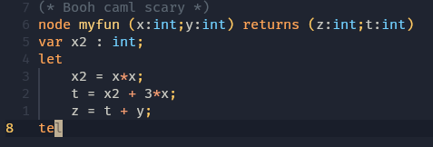

# Heptagon.nvim

Vim/Neovim plugin for the Heptagon language. Offers syntax highlighting.



## Installing

Using [vim-plug](https://github.com/junegunn/vim-plug)

```viml
Plug 'Seowlfh/heptagon.nvim'
```

Using [lazy.nvim](https://github.com/folke/lazy.nvim)

```lua
    {
    'Seowlfh/heptagon.nvim'
    }
```

## Contributing

For reference:

 - `:h ftplugin`, for writing a plugin dependent on a filetype
 - `:h ftdetect`, detecting a filetype
 - `:h syntax`, for the syntax and highlighting process
